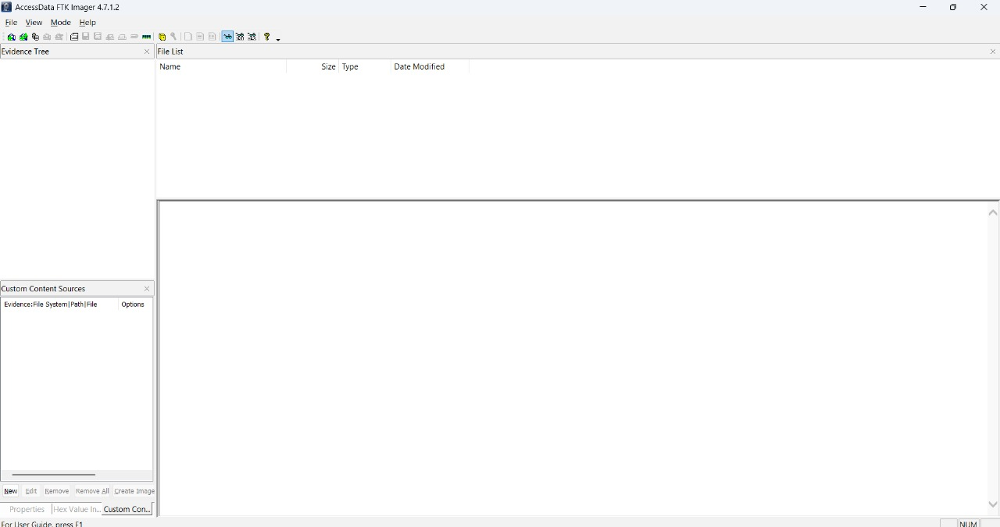
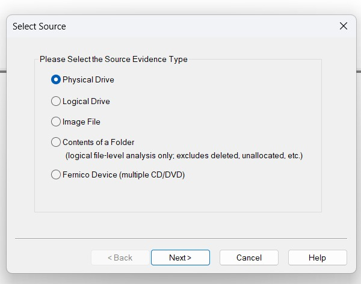
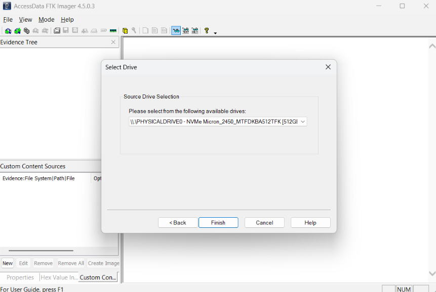
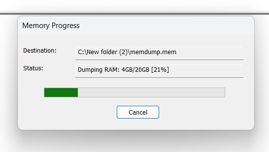
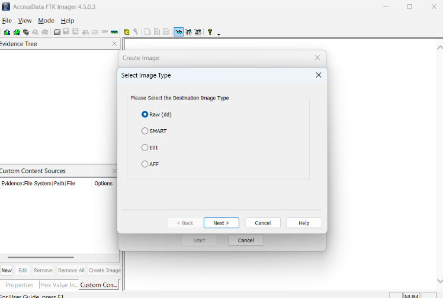
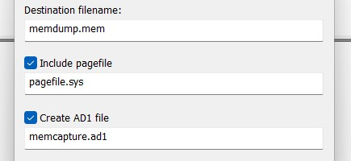
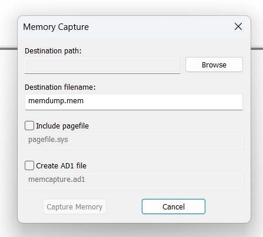
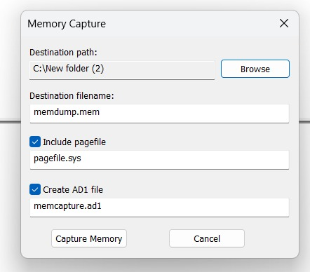
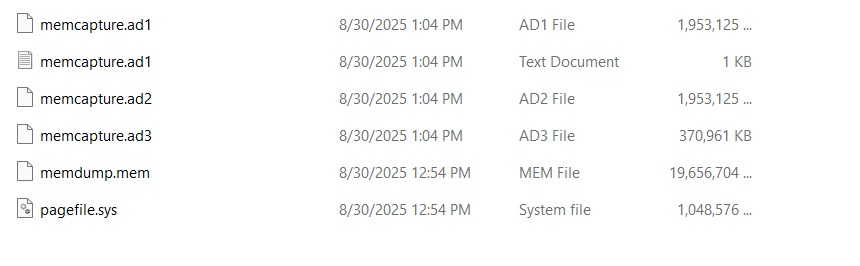

Evidence Acquisition Using AccessData FTK Imager  

---

## 🎯 Aim  
To acquire both **volatile memory (RAM)** and **non-volatile memory (Disk Image)** using **AccessData FTK Imager**, ensuring evidence integrity by generating forensic image files with hash verification.  

---

## 🛠️ Tools Required  
- AccessData **FTK Imager** (version 4.x)  
- Windows System (Target Machine)  
- External Storage for saving evidence  
- (Optional) **Write Blocker** to prevent source disk modification  

---

## 📖 Theory  
Forensic Toolkit (FTK) Imager is a free tool provided by AccessData for acquiring forensic images.  
It allows investigators to:  
- Capture **volatile memory** (RAM, pagefile)  
- Create **disk images** (physical drive, logical partitions, image files)  
- Export evidence in formats like **Raw (dd), SMART, E01, AFF**  
- Generate **AD1 forensic image files** for analysis  
- Verify integrity using **MD5/SHA1 hash values**  

---

## 📝 Procedure / Steps  

### A) Acquiring Volatile Memory (RAM)  
1. Open **FTK Imager**.  
2. Click **Capture Memory**.  
3. In the dialog:  
   - Set **Destination Path & Filename** (`memdump.mem`).  
   - Enable **Include Pagefile** (`pagefile.sys`).  
   - Enable **Create AD1 file** (`memcapture.ad1`).  
4. Click **Capture Memory** → Acquisition begins.  
5. Observe progress and wait until completion.  
6. Verify output files:  
   - `memdump.mem`  
   - `pagefile.sys`  
   - `memcapture.ad1`, `.ad2`, `.ad3`  

---

### B) Acquiring Non-Volatile Memory (Disk Image)  
1. Open **FTK Imager** → Click **Create Disk Image**.  
2. Select **Source Type** (e.g., Physical Drive).  
3. Choose the target disk → Click **Finish**.  
4. Select **Image Format**:  
   - Raw (dd)  
   - SMART  
   - E01  
   - AFF  
5. Enter **Case Details** (Case Number, Examiner Name, Notes).  
6. Provide **Destination Path, Filename, Fragment Size**.  
   - Set Fragment Size = `0` → single file.  
7. Enable **Verify Images after they are created**.  
8. Click **Start** → Image acquisition begins.  
9. On completion, check the **log file** and confirm hash values match.  

---

## 🔍 Observation (Screenshots)  

## 🖼️ Screenshot Gallery

| # | Screenshot | Caption |
|---|------------|---------|
| 1 |  | **FTK Imager Launched** – application start screen |
| 2 |  | **Select Evidence Source** – Physical Drive, Logical Drive, or Image |
| 3 |  | **Drive Selection** – NVMe PhysicalDrive0 (512GB SSD) chosen |
| 4 |  | **Acquisition in Progress** – evidence dump running (21% complete) |
| 5 |  | **Select Image Type** – RAW chosen (alternatives: SMART, E01, AFF) |
| 6 |  | **FTK Imager Interface** – evidence tree & preview |
| 7 |  | **Memory Capture Form** – before entering path and filename |
| 8 |  | **Evidence Files Created** – `memdump.mem`, `pagefile.sys`, `.ad1` |
| 9 |  | **Final Confirmation** – evidence writing completed successfully |

---

## ✅ Result  
- Successfully acquired **volatile memory** (RAM + pagefile) as `.mem` and `.ad1` files.  
- Successfully created **non-volatile memory disk image** in selected format.  
- Integrity was verified through **hash value confirmation**.  
- Thus, evidence acquisition using **FTK Imager** was carried out successfully.
  
## 📂 Portfolio Files  
- 📄 [Experiment Report (PDF)](Ex.No.5-Autopsy.pdf)    
- 🖼️ [Screenshots](screenshots/)  
