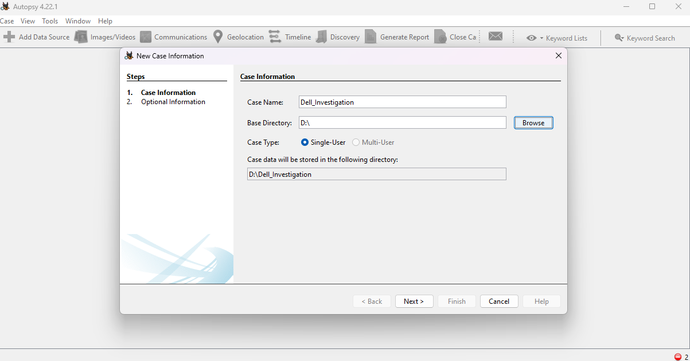
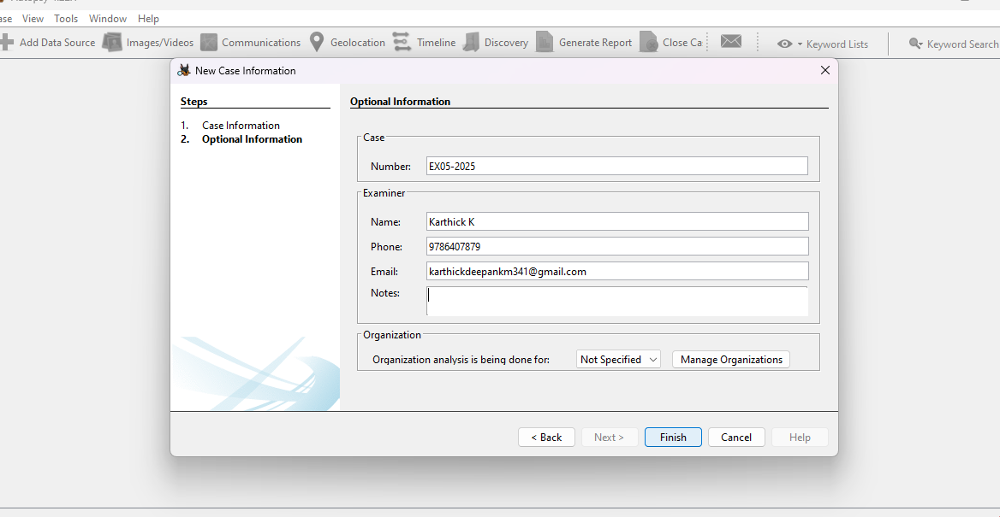
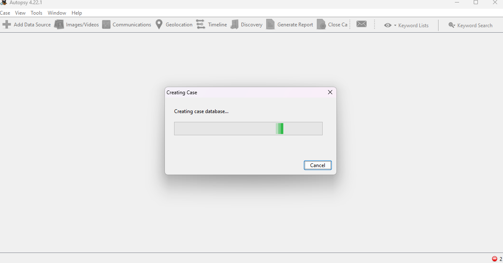
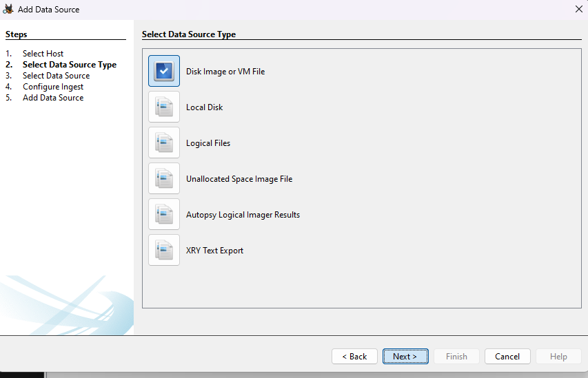
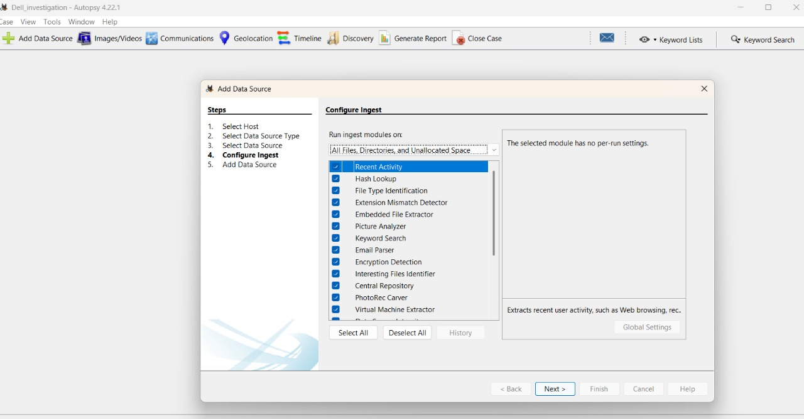
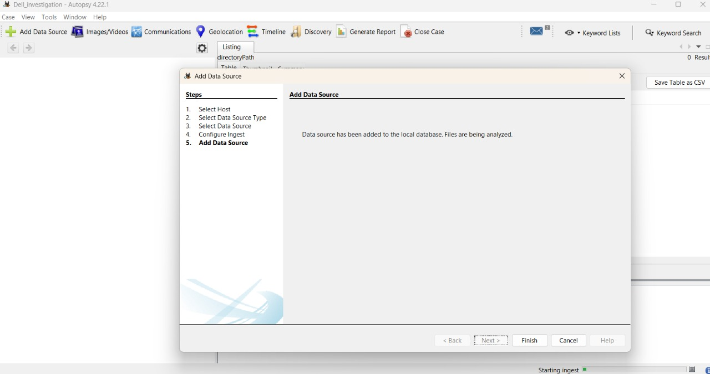
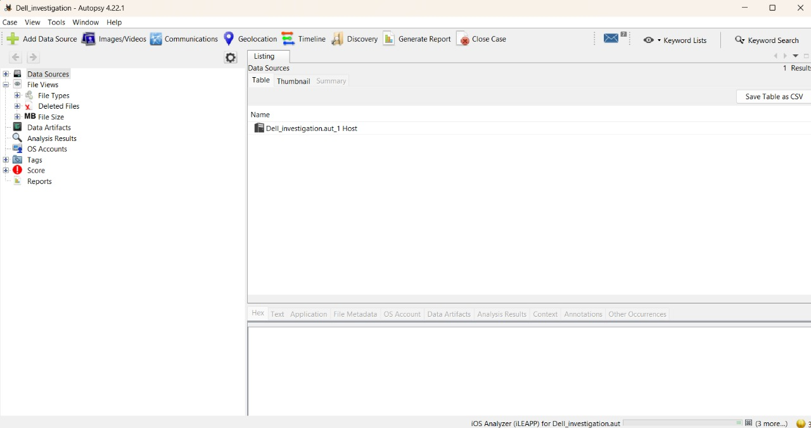
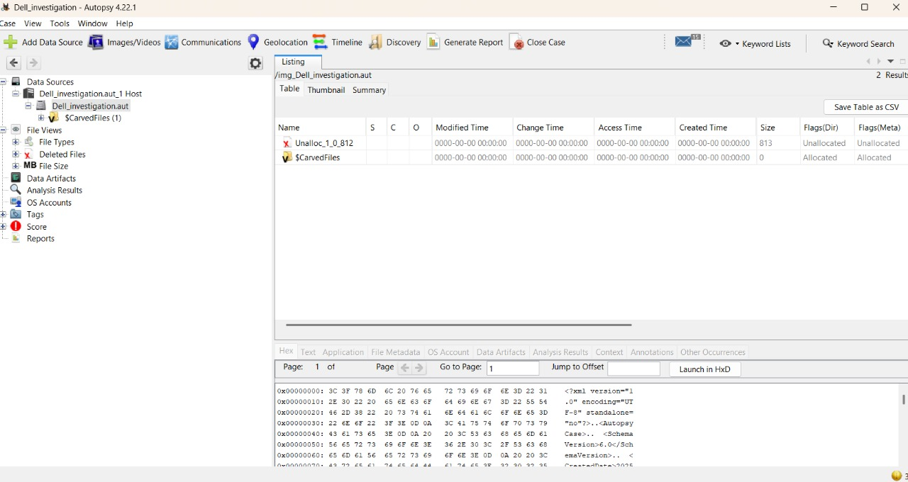

# 🧪 Experiment 5: Digital Evidence Analysis using Autopsy

## 🎯 Aim
To perform forensic investigation and evidence analysis using **Autopsy 4.22.1**, including case creation, data source addition, ingestion, and file analysis.

---

## 📝 Requirements
- Autopsy 4.22.1 (or latest version)
- Disk image / VM image / local drive for analysis
- System with sufficient RAM & storage

---

## 📌 Steps

### Step 1: Create New Case
- Open Autopsy → `Case → New Case`.
- Provide **Case Name**, **Base Directory**, and select **Case Type (Single-User)**.

### Step 2: Enter Case Information
- Fill in **Case Number**, **Examiner Details** (Name, Phone, Email).
- Add optional notes if required.

### Step 3: Case Initialization
- Autopsy creates the **case database** and prepares for evidence ingestion.

### Step 4: Select Data Source
- Choose from available options:
  - Disk Image / VM File
  - Local Disk
  - Logical Files
  - Unallocated Space Image
  - XRY Text Export

### Step 5: Configure Ingest Modules
- Select required ingest modules:
  - **Recent Activity**
  - **Hash Lookup**
  - **File Type Identification**
  - **Keyword Search**
  - **Email Parser**
  - **Encryption Detection**
  - Others as needed

### Step 6: Add Data Source
- Autopsy imports the data source into the case.
- File system structures, metadata, and carved files are indexed.

### Step 7: Evidence Analysis
- Explore:
  - **File Views** (Types, Deleted, Size)
  - **Data Artifacts** (browser history, emails, etc.)
  - **Analysis Results** (keywords, hash matches, etc.)
- Examine raw data in **Hex/Text view**.

---

## 🖼️ Screenshot Gallery

| # | Screenshot | Caption |
|---|------------|---------|
| 1 |  | **Case Information** – Enter case name & directory |
| 2 |  | **Examiner Information** – Name, phone, email |
| 3 |  | **Case Initialization** – Creating case database |
| 4 |  | **Select Data Source** – Choose Disk Image, Local Disk, etc. |
| 5 |  | **Configure Ingest** – Select analysis modules |
| 6 |  | **Add Data Source** – Evidence imported for analysis |
| 7 |  | **Evidence Tree** – File views, data artifacts, OS accounts |
| 8 |  | **File Analysis** – Unallocated file & carved files in hex view |

---

## ✅ Result
Successfully created and analyzed a forensic case using **Autopsy 4.22.1**, including case setup, evidence ingestion, and detailed artifact examination.

---
📂 Portfolio Files  
- 📄 [Experiment Report (PDF)](Ex.No.5-autospy.pdf)  
 - 🖼️ [Screenshots](screenshots/)  
